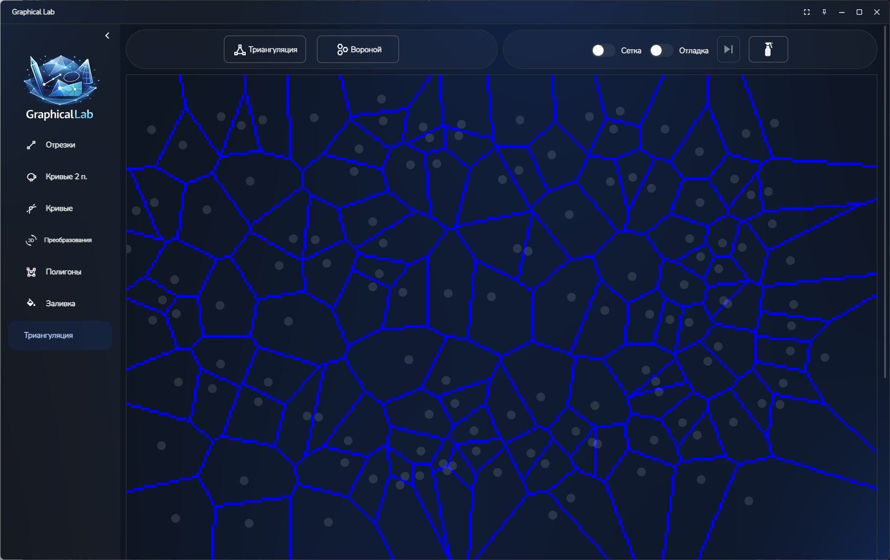
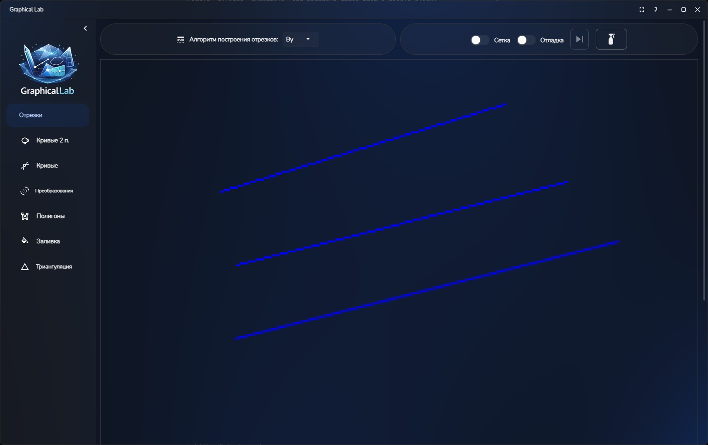
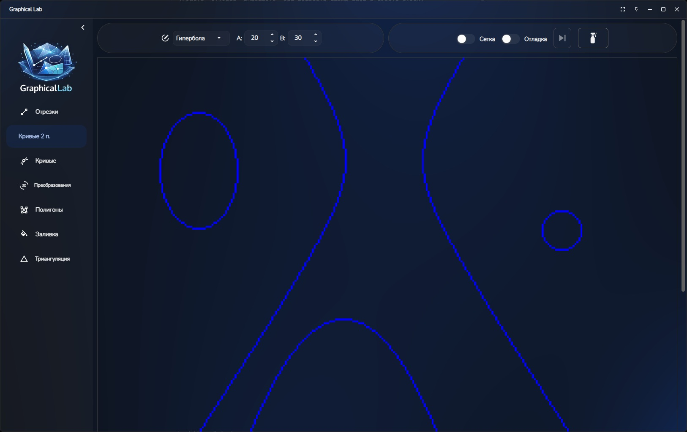
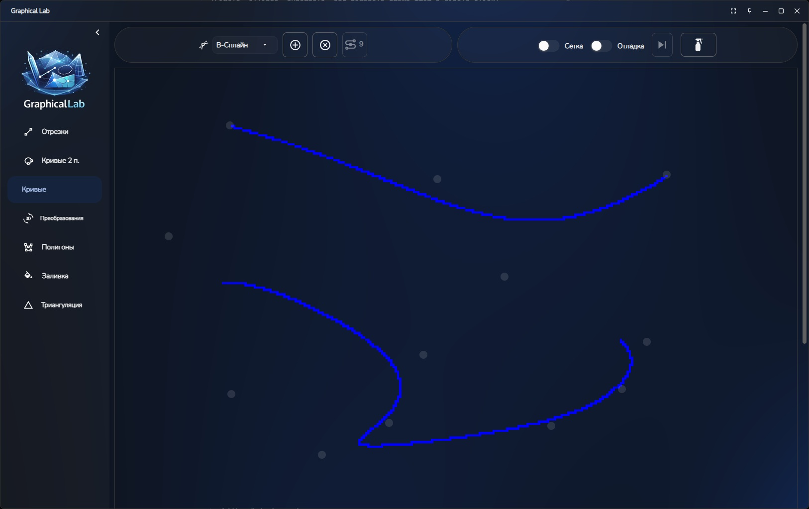
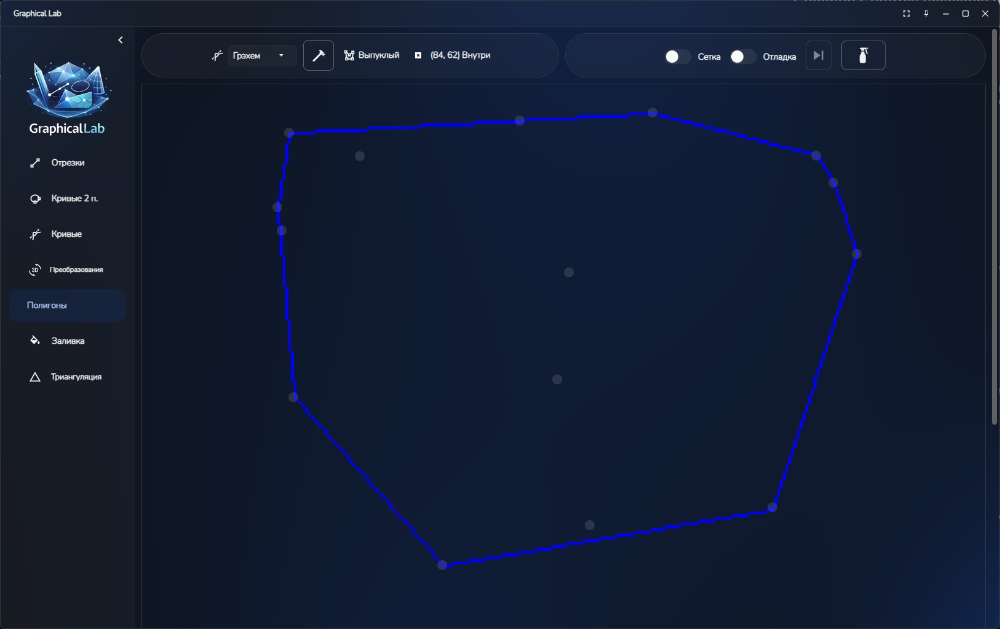
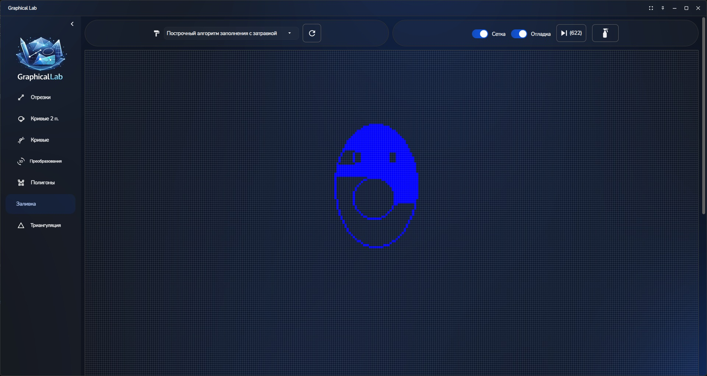
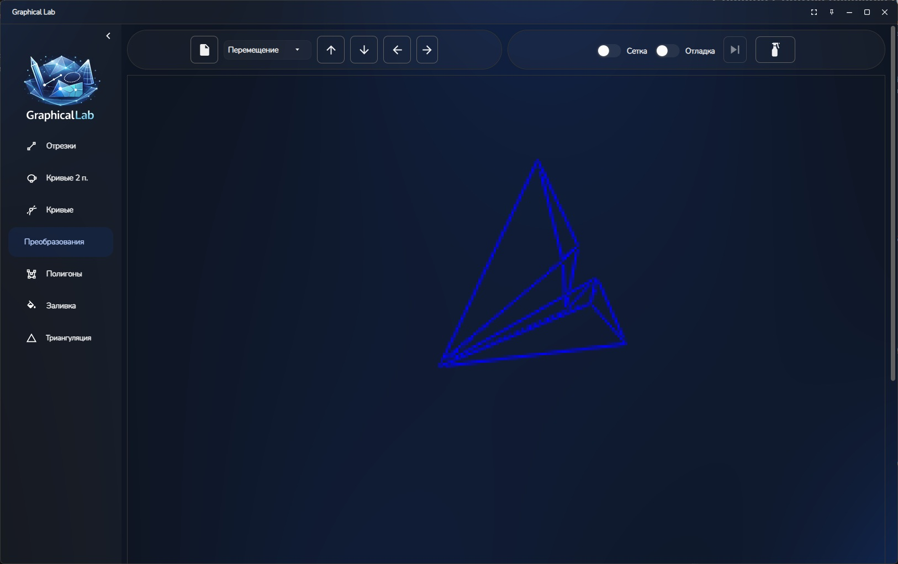
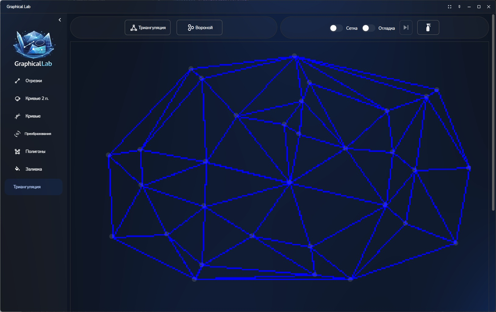

# GraphicalLab

**An interactive computer graphics laboratory built with Avalonia** 
GraphicalLab is a cross-platform desktop application developed in C# using the **Avalonia** UI framework. It serves as an educational and experimental tool for visualizing classic computer graphics algorithms. The app provides dedicated interactive canvases for each major topic, with real-time rendering, step-by-step debug mode, grid overlay, and instant visual feedback via toast notifications.

## ✨ Features

### Lines
- Draw line segments using three classic algorithms:
    - **DDA** (Digital Differential Analyzer)
    - **Bresenham** line algorithm
    - **Xiaolin Wu** anti-aliased line algorithm
- Click twice on the canvas to define start and end points

### Circles & Conic Sections
- Draw the following primitives by clicking on the canvas:
    - **Circle** (parameter `R`)
    - **Ellipse** (parameters `A`, `B`)
    - **Hyperbola** (parameters `A`, `B`)
    - **Parabola** (parameter `P`)
- Automatic parameter visibility based on selected type

### Curves
- Interactive curve construction using waypoints:
    - **Hermite** curves
    - **Bézier** curves
    - **B-Splines**
- Three interaction modes: **Add**, **Remove**, and **Connect** points
- Real-time redrawing when points are moved

### Polygons
- Build arbitrary polygons point-by-point
- Convex hull algorithms:
    - **Graham scan**
    - **Jarvis march** (Gift wrapping)
- Point-in-polygon testing with real-time feedback
- Normal vector visualization (toggleable)
- Line segment intersection detection (with highlighted intersection points)

### Polygon Filling
- Four advanced fill algorithms (works with polygons created in the Polygons tab):
    - Scanline with sorted edge list
    - Scanline with Active Edge Table (AET)
    - Simple flood fill (seed fill)
    - Scanline flood fill
- Click inside a closed polygon to fill it

### 3D Transformations
- Load 3D figures (supported formats via the figure loader service)
- Full suite of affine transformations:
    - **Translation** (Move in X/Y/Z)
    - **Rotation** (around X, Y, Z axes)
    - **Scaling** (uniform)
    - **Reflection** (flip over X/Y/Z)
    - **Perspective projection** toggle
- Keyboard shortcuts for quick manipulation (WASD, arrows, +/-, etc.)
- Real-time 3D-to-2D projection on the canvas

### Triangulation & Voronoi
- **Delaunay triangulation**
- **Voronoi diagram** generation
- Add and drag points interactively
- Instant visual update of both diagrams

## Common Controls (available on every page)

- **Debug Mode** — enables step-by-step algorithm execution
- **Next Step** button — advance one iteration (or bulk steps in some algorithms)
- **Grid** toggle — helpful coordinate grid
- **Clear Canvas** button
- Live step counter and status
- Toast notifications for successful operations and algorithm info
- MVVM architecture with CommunityToolkit for clean, maintainable code

## Screenshots

### Lines Page

*Three line algorithms in action with anti-aliasing example*

### Circles & Conics Page
  
*Circle, ellipse, hyperbola, and parabola drawn from a single click*

### Curves Page
  
*Waypoint-based curve construction with live preview*

### Polygons & Convex Hulls
  
*Graham and Jarvis hulls with normals and intersection testing*

### Filling Algorithms
  
*Scanline and flood-fill results on complex polygons*

### 3D Transformations
  
*Loaded 3D model with rotation, scaling, and perspective projection*

### Triangulation & Voronoi

*Interactive Delaunay triangulation and Voronoi diagram*

## Tech Stack

- **Framework**: Avalonia UI (cross-platform)
- **Architecture**: MVVM with CommunityToolkit.Mvvm
- **Rendering**: Custom `WriteableBitmap` + `DebuggableBitmapControl`
- **Algorithms**: Implemented in clean, separate modules (`Lines`, `Circles`, `Curves`, `Fill`, `Poly`, `Transform`, `Voronoi`, etc.)
- **Notifications**: Custom toast service
- **Debugging**: Step-by-step pixel drawing